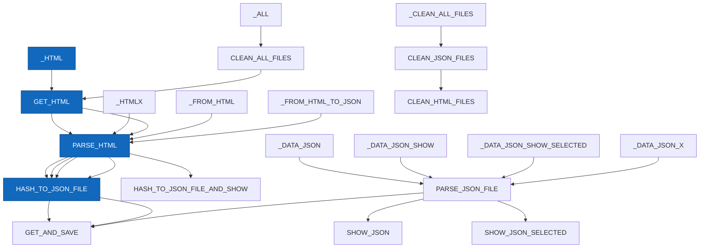

```mermaid
graph TD;
_HTML-->GET_HTML-->PARSE_HTML-->HASH_TO_JSON_FILE;
_HTMLX-->PARSE_HTML-->HASH_TO_JSON_FILE_AND_SHOW;
_ALL-->CLEAN_ALL_FILES-->GET_HTML-->PARSE_HTML-->HASH_TO_JSON_FILE-->GET_AND_SAVE;
_FROM_HTML-->PARSE_HTML-->HASH_TO_JSON_FILE-->GET_AND_SAVE;
_FROM_HTML_TO_JSON-->PARSE_HTML-->HASH_TO_JSON_FILE;
_CLEAN_ALL_FILES-->CLEAN_JSON_FILES-->CLEAN_HTML_FILES;
_DATA_JSON-->PARSE_JSON_FILE;
_DATA_JSON_SHOW-->PARSE_JSON_FILE-->SHOW_JSON;
_DATA_JSON_SHOW_SELECTED-->PARSE_JSON_FILE-->SHOW_JSON_SELECTED;
_DATA_JSON_X-->PARSE_JSON_FILE-->GET_AND_SAVE;
  classDef Active fill:#1168bd,stroke:#0b4884,color:#ffffff
  class _HTML Active
  class GET_HTML Active
  class PARSE_HTML Active
  class HASH_TO_JSON_FILE Active

```
