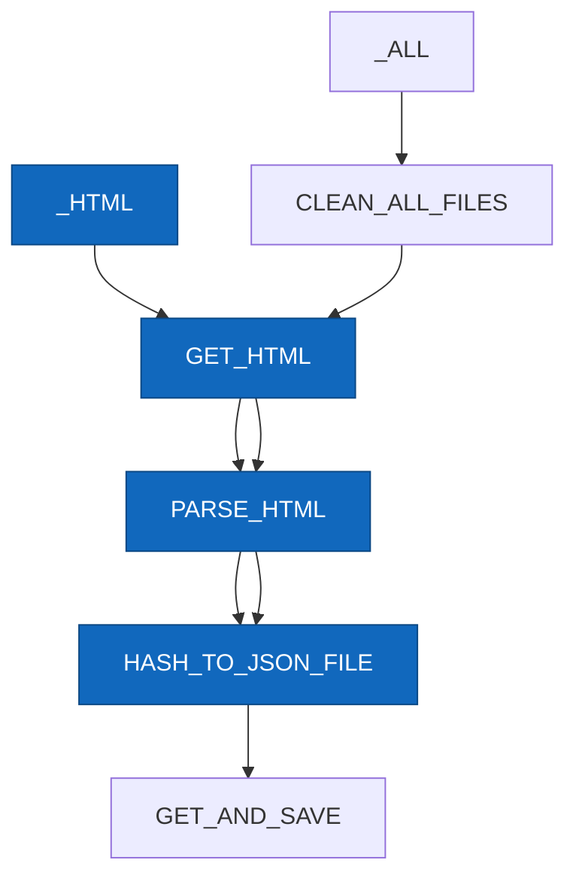
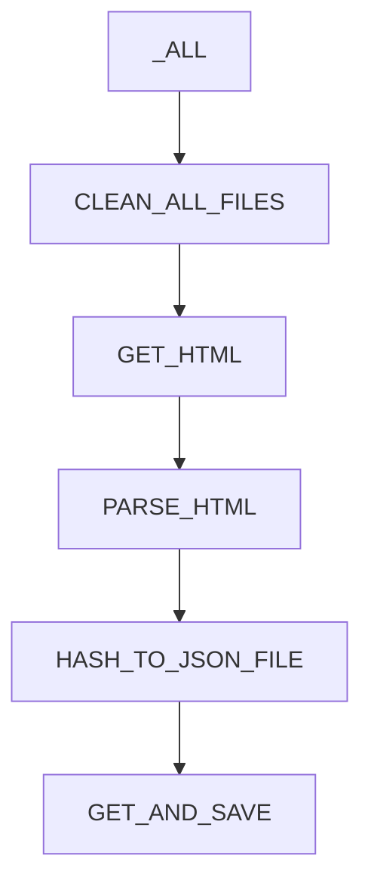

```mermaid
flowchart TD
  _HTML-->GET_HTML-->PARSE_HTML-->HASH_TO_JSON_FILE;
  _ALL-->CLEAN_ALL_FILES-->GET_HTML-->PARSE_HTML-->HASH_TO_JSON_FILE-->GET_AND_SAVE;
  classDef Active fill:#1168bd,stroke:#0b4884,color:#ffffff
  class _HTML Active
  class GET_HTML Active
  class PARSE_HTML Active
  class HASH_TO_JSON_FILE Active
```

```mermaid
graph TD;
_ALL-->CLEAN_ALL_FILES-->GET_HTML-->PARSE_HTML-->HASH_TO_JSON_FILE-->GET_AND_SAVE;
```
